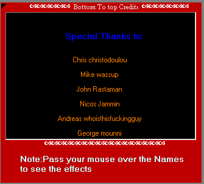



## a Scrolling Credits app

### Description

This application shows you how to implement scrolling credits. There are two different demos: top to bottom and left to right. You can click on the credited individual to send him/her an e-mail.
 
### More Info
 

             |
---                |---
**Submitted On**   |2000-08-29 00:16:02
**By**             |[Chris Christodoulou](https://github.com/Planet-Source-Code/PSCIndex/blob/master/ByAuthor/chris-christodoulou.md)
**Level**          |Intermediate
**User Rating**    |4.5 (36 globes from 8 users)
**Compatibility**  |VB 5\.0, VB 6\.0
**Category**       |[Miscellaneous](https://github.com/Planet-Source-Code/PSCIndex/blob/master/ByCategory/miscellaneous__1-1.md)
**World**          |[Visual Basic](https://github.com/Planet-Source-Code/PSCIndex/blob/master/ByWorld/visual-basic.md)
**Archive File**   |[CODE\_UPLOAD9672962000\.zip](https://github.com/Planet-Source-Code/chris-christodoulou-a-scrolling-credits-app__1-11291/archive/master.zip)

